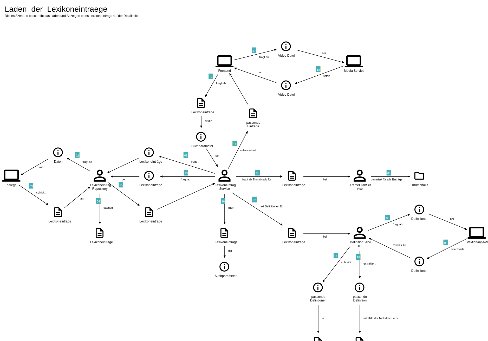

# Architektur

## Frontend

Die Ordnerstruktur des Frontendprojekts ist flach aufgebaut und orientiert sich an keinem tiefer geschachtelten Schema. Sie besteht aus Angular-Komponenten, Modulen, Services, Fachwerten und Materialien. 

### Komponenten
Das Frontend der Anwendung setzt sich aus folgenden Komponenten zusammen:

#### App
Die `app` Komponente ist der Einstiegspunkt der Anwendung. In ihr liegt das `router-outlet`, welches die 
Navigation der einzelnen Komponenten steuert. Der Standardpfad verweist auf die [Landingpage](#landingpage).

Eingebettete Komponenten:

- `footer` (siehe [Footer](#footer))

#### Header
Die `header` Komponente bietet schnellen Zugriff die Suchen (siehe [Search-Menu](#search-menu)) und die Filter für die Fachgebiete.
Über letztere gelangt man auf die [Alphabetical-Overview](#alphabetical-overview) Komponente. 

Eingebettete Komponenten:

- `search-menu`

#### Search-Menu
Das `search-menu` ist eine Container-Komponente, welche über zwei Buttons auf die Komponenten [Gebaerdenschrift-Search](#gebaerdenschrift-search) 
und [Text-Search](#text-search) verweist.

Eingebettete Komponenten:

- keine

#### Footer
Über den `footer` gelangt man zu den Komponenten [Contact](#contact) und [Page](#page).

Eingebettete Komponenten:

- `contact`
- `page`

#### Landingpage
Wenn keine besonderen URL-Parameter angegeben wurden, wird diese Komponente angezeigt.
Über entsprechende Buttons der `landingpage` gelangt man entweder zu den 
jeweiligen Suchen (siehe [Gebaerdenschrift-Search](#gebaerdenschrift-search) bzw. [Text-Search](#text-search))
oder zu den einzelnen Übersichtsseiten der jeweiligen Fachgebiete bzw. zur Gesamtübersicht 
aller Lexikoneinträge. (Siehe [Alphabetical-Overview](#alphabetical-overview))

Eingebettete Komponenten:

- keine

#### Alphabetical-Overview
Der Inhalt der Übersichtsseite ist abhängig vom übergebenen URL-Parameter `fachgebiet`. 
Ist der Parameter gesetzt, werden alle Lexikoneinträge des angegebenen Fachgebiets angezeigt. 
Ist dieser jedoch nicht angegeben, gelangt man zur Gesamtübersicht der Lexikoneinträge aller Fachgebiete.

Die Lexikoneinträge der Übersichtsseite werden über die [Search-Result-Entry](#search-result-entry) Komponente dargestellt.

Eingebettete Komponenten:

- `header`
- `search-result-entry`

#### Search-Result-Entry
Diese Komponente stellt den Titel, die Symbole der Fachgebiete sowie die Gebärdenverschriftlichung eines Lexikoneintrags dar.

Eingebettete Komponenten:

- `entry-title-display`

#### Entry-Title-Display
Mithilfe der `entry-title-display` Komponente wird der Fachbegriff eines Lexikoneintrags angezeigt.

Eingebettete Komponenten:

- keine

#### Entry-Detail

In [dieser](https://sign2mint.de/information) Komponente werden alle Details zu einem Lexikoneintrag angezeigt. Welcher Lexikoneintrag angezeigt wird, 
legt der Aufbau der URL fest.

Damit einzelne Lexikoneinträge mit anderen Menschen leicht geteilt werden können, ist jedem Eintrag eine eindeutige URL,
basierend auf dem Schema "/entry/Fachbegriff/{id}", zugeordnet.
Beim Teilen eines Eintrags über eines der entsprechenden Symbole unter dem Video wird eben diese URL verwendet.
(Damit beim Teilen in den sozialen Medien eine passende Vorschau für die Seite generiert werden kann, wird Rendertron verwendet,
siehe [infrastruktur.md#generell](infrastruktur.md#generell).)

Eingebettete Komponenten:

- `header` (siehe [Header](#header))
- `entry-title-display` (siehe [Entry-Title-Display](#entry-title-display))
- `entry-definition`

#### Entry-Not-Found
Wenn die angegebene URL zur Detailseite eines Lexikoneintrags ungültig ist, wird diese Komponente angezeigt.

Eingebettete Komponenten:

- `header` (siehe [Header](#header))

#### Entry-Definition
Diese Komponente stellt die, über das Backend angefragte, Wiktionary Definition eines Fachbegriffs dar. Zur Darstellung von
Formeln innerhalb der Definition wird [Mathjax](http://docs.mathjax.org/en/latest/) verwendet.

Eingebettete Komponenten:

- keine

#### Gebaerdenschrift-Search
Für die Suche von Lexikoneinträgen mit Hilfe von Gebärden wird diese Komponente verwendet. 

Eingebettete Komponenten:

- `header` (siehe [Header](#header))
- `search-result-entry` (siehe [Search-Result-Entry](#search-result-entry))
- `gebaerden-tastatur`

#### Gebaerden-Tastatur
Die Gebärden werden über die Schriftart [SuttonSignWritingOneD](https://sutton-signwriting.github.io/font-ttf/) auf einer Tastatur angezeigt.

Eingebettete Komponenten:

- keine

#### Text-Search
Stellt eine textbasierte Suche für Lexikoneinträge bereit.

Eingebettete Komponenten:

- `header` (siehe [Header](#header))
- `search-result-entry` (siehe [Search-Result-Entry](#search-result-entry))

#### Suggestion
Stellt ein Formular zum Einsenden von Vorschlägen für Fachbegriffe bereit.

Eingebettete Komponenten:

- `header` (siehe [Header](#header))

#### Video-Share
Diese Komponente wird von externen Crawlern angesprochen, um die Videos geteilter 
Lexikoneinträge auf dem entsprechenden Social-Media-Kanal anzuzeigen. 

Eingebettete Komponenten:

- keine

#### Contact
Über diese Komponente kann der Benutzer eine E-Mail an Sign2MINT senden.

Eingebettete Komponenten:

- `header` (siehe [Header](#header))

#### Page
Bei der `page`-Komponente handelt es sich um die statischen Seiten "Über Sign2MINT", "Informationen",
"Datenschutz" und "Impressum", deren Html vom Backend geliefert wird.

Eingebettete Komponenten:

- `header` (siehe [Header](#header))

### Frontend-Services

Alle Angular Services liegen im Ordner `frontend/src/app/services`. Die meisten von ihnen stellen nur Methoden bereit, um Anfragen an das Backend zu schicken.
Es gibt jedoch drei Ausnahmen:

- Der `device.service` enthält Methoden zum Abfragen des aktuellen Gerätetyps. Je nach Auflösung wird zwischen Mobile, Tablet und Desktop unterschieden.
- Der `scroll.service` sorgt dafür, dass beim Zurückgehen auf eine vorherige Seite die letzte Scrollposition wiederhergestellt werden kann.
- Der `local-storage.service` stellt Methoden für den Zugriff auf den LocalStorage zur Verfügung. Dieser wird verwendet, um die Zustände einzelner Komponenten zu speichern.

### Module

Von den Standard Angular Modulen abgesehen ist das `math.module` das einzig besondere im Projekt.
Die dort enthaltene Direktive wird zum Anzeigen von Formeln in der Definitions-Beschreibung eines Fachbegriffs verwendet.

## Backend 

Die Projektstruktur des Backends besteht aus den Paketen:

- airtable: Klassen und Methoden für die Synchronisation mit [Airtable](https://airtable.com/)
- configurations: Konfiguration für E-Mail und CORS
- controller: [Spring Controller](#controller)
- mappers: Mapper für die Konvertierung eines JSON Strings zu einer Liste von Lexikoneinträgen
- materials: Entitäten und Value Objects
- repositories: Klassen zum Cachen externer Daten für Lexikoneinträge und SymbolIds
- services: Klassen zum Ausführen von Fachlogik (siehe [Backend-Services](#backend-services))
- validation: Validierungsmethoden für Lexikoneinträge

### Controller

Da das Backend auf [Spring Boot](https://spring.io/) basiert, werden alle Anfragen von Controllern an die entsprechenden Services weitergeleitet.

Folgende Controller sind im Projekt enthalten:

- EMailController: Versendet Vorschläge für Fachgebärden, sowie Kontaktanfragen via E-Mail an das Sign2MINT Team (`EMailService`)
- LexikoneintragController: Behandelt die serverseitige Suche und Filterung von Lexikoneinträgen (`LexikoneintragService`)
- PageController: Liefert die statischen Seiten (Über Sign2MINT, Impressum, Informationen, Datenschutz) (`PageService`)
- SymbolIdController: Konvertiert SymbolKeys zu SymbolIds (`SymbolIdRepository`)
- ThumbnailController: Liefert Thumbnails für die Videos der Lexikoneinträge (`FrameGrabService` und `LexikoneintragService`)
- RestExceptionHandler: Loggt unbehandelte Exceptions (rein technischer Controller ohne Service)

### Backend-Services

Zu den wichtigsten Services zählen der `LexikoneintragService`, der `DefinitionService` und der `FrameGrabService`.

#### LexikoneintragService

Der `LexikoneintragService` stellt verschiedene Methoden zum Filtern und Sortieren von Lexikoneinträgen bereit und 
enthält Methoden zum Suchen von Einträgen über den Fachbegriff oder eine der in der Gebärdenverschriftlichung verwendeten SymbolIds.

Beim Initialisieren des Services werden über das `LexikoneintragRepository` die Lexikoneinträge von der delegs API abgerufen. 
Dabei werden die im zurückgelieferten JSON String enthaltenen Einträge mit Hilfe der Klasse `LexikonEintragsJsonValidator` validiert und anschließend über den `LexikonEintragMapper` zum
Typ `Lexikoneintrag` gemappt.

#### FrameGrabService

Nachdem die Lexikoneinträge über diese Weise abgerufen wurden, wird über den `FrameGrabService` für das Video von jedem Eintrag ein aussagekräftiges Thumbnail generiert.
Dafür wird der Frame nach 1/3 der Videogesamtdauer verwendet.

#### DefinitionService

Zu jedem Lexikoneintrag gehört eine Definition, welche für gewöhnlich von [Wiktionary](https://www.wiktionary.org/) kommt.
Die delegs-API stellt für einen Lexikoneintrag jedoch nur Metadaten und Verweise bereit.
Die eigentliche Definition selbst muss noch vom Backend geladen werden.
Diese Aufgabe erfüllt der `DefinitionService`, welcher die entsprechende Definition mittels der von Wiktionary bereitgestellten [API](https://de.wiktionary.org/w/api.php) lädt.
In Wiktionary stehen pro Fachbegriff oft viele verschiedene, fachbereichsabhängige Definitionen.
Darum muss der Service die Definition, welche in den Metadaten referenziert ist, korrekt aus der API-Antwort parsen und speichert diese dann auch direkt in der entsprechenden Entität.
Auf diese Weise muss die gleiche Definition nicht jedes Mal neu über die externe API abgefragt werden, wenn diese benötigt wird.

### Repositories

#### LexikoneitragRepository 
Ruft die Lexikoneinträge von der delegs API ab und hält diese im Cache, sowie in einer JSON Datei zur schnelleren Bereitstellung der Daten, nach einem Serverneustart.

#### SymbolIdRepository 
Hält alle über die [Airtable API](https://airtable.com/api) abgerufenen SymbolIds als Cache, sowie zur schnelleren Bereitstellung in einer JSON Datei.

### Resources

Zum Konfigurieren der Anwendung wird die Konfigurationsdatei `src/main/resources/application.yaml` verwendet.
Diese konfiguriert einerseits die Einstellungen für den EMailService, wie stark vom Backend geloggt werden soll und über welche URL die Lexikoneinträge von der delegs-API bereitgestellt werden.

Nicht alle Seiten im Frontend sind Angular-Komponenten, es gibt auch statische Seiten ([siehe Page Komponente](#page)).
Die HTML-Dateien für diese Seiten liegen in `src/main/resources/html-files`.

## Kommunikation

Die folgende [Domain Story](https://domainstorytelling.org/) beschreibt die Front- und Backend-Kommunikation

